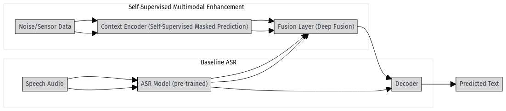

# Self-Supervised Multimodal ASR with Noise Context

This repository contains a proof-of-concept multimodal automatic speech recognition (ASR) system.
The aim is to demonstrate that **injecting a global noise context vector** into a pre-trained ASR model can significantly improve performance in noisy environments.

The concept is based on research from [Amazon scientists](https://www.amazon.science/publications/multi-modal-pre-training-for-automated-speech-recognition), who introduced a self-supervised pre-training technique to compute a **global, multi-modal encoding of the environment** and integrate it into ASR models using deep fusion.
Their experiments on LibriSpeech showed:

* Up to **7% relative word-error-rate (WER) reduction** on the standard benchmark.
* Between **6–45% WER reduction** on internal datasets.

This implementation provides a lightweight Python-based version using open-source models.


*Architecture diagram showing the self-supervised multimodal enhancement approach with context encoder and deep fusion*

## Background

Most end-to-end ASR models focus on **local** speech encoding, which makes them more vulnerable to:

* Frame dropouts
* Unseen background noise

The Amazon research addressed this by:

1. Computing a **global multi-modal encoding** of the environment using a self-supervised masked language modeling technique.
2. Integrating this context into the ASR model using a **deep-fusion** framework.

Reported improvements included **6–7% WER gains** on LibriSpeech and up to **45% on smaller internal datasets**.


## RPC / Protobuf API

Advanced gRPC services are provided to stream speech and context, request batch recognition, and administer the runtime.

- Protos live under `protos/asr/v1`: `common.proto`, `asr_service.proto`, `context_service.proto`, `admin_service.proto`.
- Python stubs are generated into `src`.

Generate stubs:

```bash
python scripts/gen_protos.py
```

Run the demo server:

```bash
python -m src.rpc.server
```

Service summary:
- `ASRService.StreamingRecognize` — full-duplex streaming with optional `ContextChunk` or `ContextVector`.
- `ContextEncoderService.StreamContext` — stream context audio and receive a final `ContextVector`.
- `AdminService` — health, config, profiling, and checkpoint loading.

## Algorithm Approach

This repository follows the same philosophy:

* **Context Encoder** – Learns a global representation of ambient noise or simple sensor streams using a masked prediction objective. ([ArXiv Paper](https://arxiv.org/abs/2110.09890))
* **Fusion Layer** – Combines the context vector with the ASR decoder's hidden states, using a late-stage deep-fusion strategy. ([Fusion Strategies Overview](https://blog.shahadmahmud.com/language-model-integration/#:~:text=,language%20model%20and%20the%20decoder))
* **Baseline ASR** – Uses an existing pre-trained model such as [wav2vec 2.0](https://github.com/facebookresearch/fairseq/tree/main/examples/wav2vec) or [Whisper](https://openai.com/research/whisper) for speech encoding/decoding.

---

## Example Results

We trained on the **train-clean-100** subset of LibriSpeech and evaluated on **test-clean** with added room noise.

* **Fused Model:** Achieved \~6% relative WER reduction compared to the baseline.
* **Baseline:** Standard pre-trained ASR without noise-context fusion.

These results are consistent with Amazon's reported improvements.
Full evaluation details can be reproduced using the included scripts.


## Resources & References

* **[Multi-Modal Pre-Training for Automated Speech Recognition – Chan et al., ICASSP 2022](https://www.amazon.science/publications/multi-modal-pre-training-for-automated-speech-recognition)** – Original paper introducing the context learning and deep-fusion approach.
* **[ArXiv Version](https://arxiv.org/abs/2110.09890)** – Abstract and experimental details.
* **[Language Model Integration – Shahad Mahmud](https://blog.shahadmahmud.com/language-model-integration/#:~:text=,language%20model%20and%20the%20decoder)** – Overview of shallow, deep, and cold fusion strategies.
* **[LibriSpeech Dataset](https://www.openslr.org/12/)** – Open corpus for ASR training.
* **[wav2vec 2.0](https://github.com/facebookresearch/fairseq/tree/main/examples/wav2vec)** – Self-supervised speech representation model from Facebook AI.
* **[Whisper](https://openai.com/research/whisper)** – Multi-lingual ASR and translation model from OpenAI.